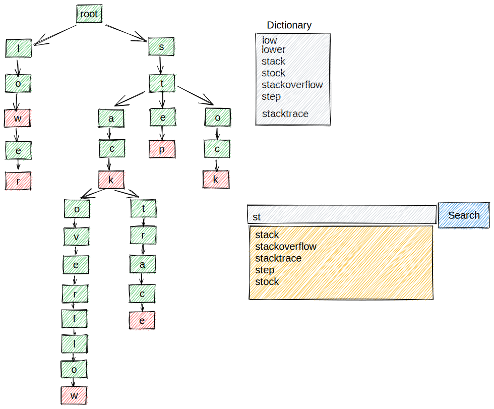

## Computer Science Library

### Motivation
* Learn how to design and implement algorithms for solving common computer science problems.
* Understand and learn how to implement all traditional Data strucutures and algorithms.
* Keeping this repo as a reference library containing classical Data Structures and Algorthims.

