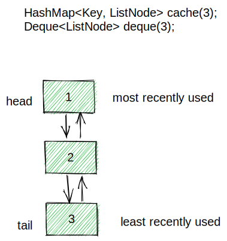

## Least Recently Used (LRU) Cache.

### Abstract
Least Recently Used (LRU) is a common caching strategy. It defines the policy to remove the least recently used elements from the cache to make room for new elements when the cache is full(Cache eviction). 

### Pros
* Accessing and deletetion of the least recently used elements in constant time.
* Insertion and updating of cache elements in constant time.

### Cons
* LRU cache is often implemented by pairing a doubly linked list with a hash map. And the doubly linked list itself holds two addresses in a node, one is of the next node and the other one is of the previous node. This makes the LRU cache is space heavy.

### High-level design


### How to run
```ruby
# compile first
javac Main.java

# then run the class
java Main
```
