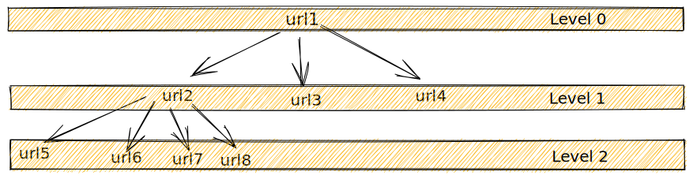

## Web Crawler
### Abstract
The web crawler is a program, which automatically traverses the web by downloading documents and following links from page to page. They are mainly used by search engine, so that pages can be indexed in advance to be able to respond to many user queries rapidly.
### Scope
* Finds and downloads web pages automatically.
* Don’t crash(Timeout, File Not Found, Server Unreachible etc.) if download of html page failes.
* Limits the Size and Depth of a Crawl

### Input
* List of URLs to crawl.

### Proposed Solution
We can use the graph traversal algorithms DFS or BFS here, both have the same time complexity `O(|V|+|E|)`, but the traversal order is different. 
#### DFS:
##### Pros:
* Recursive version is easy to implement.
* Starts at the root node and explores as far as possible along each branch before backtracking.

##### Pros:
* Limited Call-stack size might cause the StackOverflowError.
* Iterative implemetation requires an extra memory(Stack Data Structure).

#### BFS:
##### Pros:
* Level-Order traversal. Starts at the tree root and explores all nodes at the present depth prior to moving on to the nodes at the next depth level.

##### Pros:
* Implementation reqires an extra memory(Queue data structure).

#### Prefered Solution

It is preferable to traverse all links of a particular page and then go to another page. Thus, Level order traversal is ideal for this case. Since we don't have unlimited memory, we have to limit number of pages to visit by introducing `MAX_NUMBER_OF_PAGES`.

